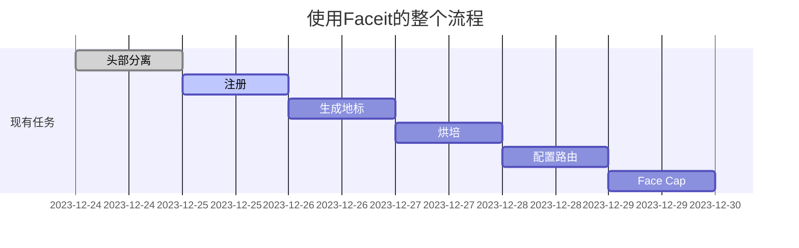

@[TOC](blender使用faceit绑定自己的表情控制模型)

# faceit是个神器，来记录一下如何让表情动起来

blender-3.6.2  +   faceit-1.3.3  + AddRoutes-0.34 + ios的Face Cap
blender4.0似乎有问题，先用这个吧
计划用elise演示一下


## 保持相对位置

mustardui似乎有一些骨骼冲突，想删掉原有的骨骼，要保证相对位置，
用父子节点是个好办法
把所有元素的父节点都变成body，并且保持变换
<kbd>Ctrl</kbd> + <kbd>p</kbd>


包括头发和衣服，
然后删掉 骨骼也没有变形才行，
现在删掉原来的骨骼：


## 头部分离，方便后续绑定faceit

如果以上都没有变形，如果有变形，眉毛等，就还用父子绑定的办法，让他们同时放缩

<kbd>G</kbd>把头发移动走
<kbd>H</kbd>把衣服隐藏掉
切换“编辑模式”，打开透视模式，选择头部

<kbd>p</kbd>分离头部和身体
并双击给头部重新命名为headhead


切换到物体模式
把脸上的位置从身体中分离，shift选中分离的几个内容后，**鼠标切换到主屏幕**
<kbd>Alt</kbd> + <kbd>p</kbd>
选择 <kbd>清空并保存变换结果</kbd>，否则就飞走咯
其实这一步也可以不用，只要能找到这些内容就好了，注意左虹膜iris在Eye left里面，


这样就可以开始使用faceit注册了
如果alt +p不起作用，注意看下自己的设置，是否用alt去模拟三键鼠标了


## faceit的注册
<kbd>1</kbd> ，让视图变正面，
<kbd>n</kbd>，打开右边侧栏，
**选中头部后**，一定要选中头部呀，
点<kbd>注册面部对象</kbd>

看这里已经把刚才建立的 “headhead” 注册成 “MAIN”了，
把右边的 眼睛，睫毛，嘴 和舌头都注册进来


记得，虹膜 iris在眼睛里面也要注册进来
点“注册”中的内容 和下面独对应的部分，选择一个“注册”里面的内容，下面“注册(顶点组)”依次点击，绑定
以此把
<kbd>left eyeball</kbd> 对应 左眼球，<kbd>right eyeball</kbd> 对应 右眼球
<kbd>other left </kbd>对应左侧 虹膜 iris，<kbd>other right </kbd> 对应 右 虹膜 iris
<kbd>eyelashes </kbd>对应 上睫毛
<kbd>upper teeth</kbd> 对应上牙，<kbd>lower teeth</kbd> 对应 下牙
<kbd>tonegue </kbd>对应 舌头 


## rig生成地标
在<kbd>Rig</kbd>的tab下点击<kbd>生成地标</kbd>


先对齐下巴，再对齐眼睛和脸颊


点击<kbd>Project Landmarks</kbd> ，把点附着在脸上并调整侧脸

<kbd>生成绑定和动画</kbd>
打开“骨骼”选项

选择头部，<kbd>绑定</kbd>
和次要绑定<kbd>Bind Secondary</kbd>


空格测试表情，开始跑500多帧，来测试表情


 
## Animate可以修正表情

切换到<kbd>Animate</kbd>tab 调整每一个表情，如果有问题可以会退


感谢b站的阿天，讲得很详细，看了好几遍: [link](https://www.bilibili.com/video/BV1dy4y1T7gy/?spm_id_from=333.999.0.0&vd_source=1ed400aa8fdc6fe03ecfa7ce0fc2c692).


## 烘培之前记得保存
<kbd>Bake ARKit Shape Keys</kbd> 进行烘培


如果有问题可以
<kbd>Back to Rigging</kbd> 重新调试表情，一般是嘴角容易有问题，注意眉毛和眉框，
<kbd>Generate Test Action</kbd> 可以继续看表情效果

选<kbd>Auto Reorder Indices </kbd>
选择
<kbd>FaceCap</kbd>

就可以配置 routes了

<kbd>FaceCap</kbd>


去[博客设置](https://mp.csdn.net/console/configBlog)页面，查看ip的 `代码片`.
```shell
// An highlighted block
ifconfig;
```

最后把头发加回来看看效果
<kbd>Alt</kbd> + <kbd>G</kbd>


打开 ios 的 Face Cap，链接到这个ip就可以，用自己的表情控制模型表情了


## 使用Faceit的整个流程


- 关于 **甘特图** 语法，参考 [这儿][2],

